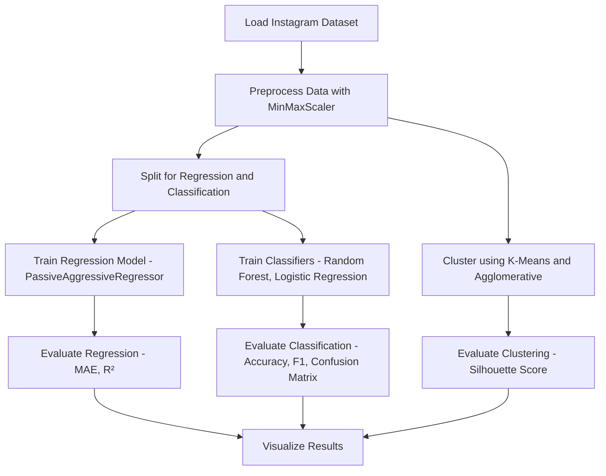

# 📈 InstaReach – Instagram Reach Analysis using Machine Learning

  
  
  


> 📊 A machine learning project that predicts Instagram post impressions and classifies posts as "Reach" or "No Reach" based on engagement metrics like Likes, Comments, and Follows.

---

## 🚀 Features

- 📈 **Impression Prediction** using Linear Regression (R² score: 0.8795)
- 🔍 **Post Classification** into "Reach" and "No Reach" using Decision Tree, Random Forest, and Logistic Regression
- 🧠 **Unsupervised Learning** using K-Means and Agglomerative Clustering (Silhouette Scores: 0.3962 & 0.4538)
- 📊 **Feature Importance** analysis to identify most influential engagement metrics
- 🧪 Evaluated using MSE, MAE, Accuracy, Precision, Recall, and F1-score

---

## 📌 Technologies Used

| Component         | Tool/Library         |
|------------------|----------------------|
| Language          | Python 3.10          |
| Regression Model  | LinearRegression     |
| Classification    | Decision Tree, Random Forest, Logistic Regression |
| Clustering        | K-Means, Agglomerative Clustering |
| Evaluation        | Scikit-learn (R², MAE, Confusion Matrix, Silhouette Score) |
| Visualization     | Matplotlib, Seaborn  |
| Dimensionality Reduction | PCA          |
| Preprocessing     | MinMaxScaler         |

---

## ⚙️ Installation

```bash
git clone https://github.com/akasha456/Instagram-Reach-Analysis
cd Instagram-Reach-Analysis
pip install -r requirements.txt
```

---

## 🧠 How It Works



---

## 📊 Model Evaluation Snapshot

### 🔷 Regression Performance

| Metric | Training | Testing |
|--------|----------|---------|
| R² Score | 0.8795 | 0.8778 |
| MAE     | 1003.44 | 1370.85 |
| MSE     | 2.28M   | 4.75M   |
| Explained Variance | 0.8795 | 0.8820 |

---

### 🔶 Classification Accuracy

| Model               | Accuracy |
|--------------------|----------|
| Decision Tree       | 0.7500   |
| Random Forest       | 0.8750   |
| Logistic Regression | 0.8333   |

#### 🧪 Random Forest Classifier

- Precision: 0.82 (Class 0), 0.92 (Class 1)  
- Recall: 0.90 (Class 0), 0.86 (Class 1)  
- F1-Score: 0.86 (Class 0), 0.89 (Class 1)  
- Macro Average: 0.87  
- Weighted Average: 0.88  

---

### 📌 Feature Importance

| Feature         | Importance |
|-----------------|------------|
| Likes           | 0.5693     |
| Follows         | 0.1967     |
| Comments        | 0.1198     |
| Profile Visits  | 0.1142     |
| Saves, Shares   | 0.0000     |

---

### 🔍 Clustering Performance

| Clustering Algorithm     | Silhouette Score |
|--------------------------|------------------|
| K-Means                  | 0.3962           |
| Agglomerative Clustering | 0.4538           |

---

## 🌐 Future Enhancements

- 📊 Integrate Instagram Graph API for live engagement data
- 🤖 Implement cross-validation and hyperparameter tuning
- 🎯 Add engagement rate as a new target or feature
- 📌 Remove or engineer low-importance features like Saves and Shares
- 📉 Experiment with advanced clustering (DBSCAN, GMM)

---

## 📜 License

This project is licensed under the MIT License.

---

## 💬 Acknowledgements

- [Instagram Analytics](https://developers.facebook.com/docs/instagram-api/) for data understanding  
- [Scikit-learn](https://scikit-learn.org) for modeling and evaluation  
- [Matplotlib](https://matplotlib.org) and [Seaborn](https://seaborn.pydata.org) for visualizations  

---

